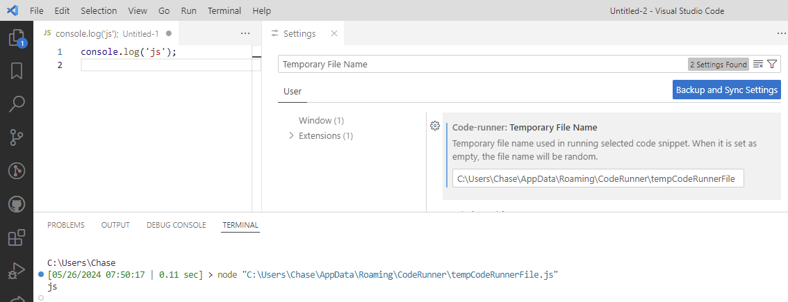

## Code Runner Fork

### Changes

- Changed `Temporary File Name` setting to resolve absolute and relative paths, instead of only just a file name. ie:
  - `C:\Users\<user name>\AppData\Roaming\CodeRunner\tempCodeRunnerFile`
  - `./temp/tempCodeRunnerFile`
  - Environment variables (ie. `%APPDATA%`) will not be resolved. Shell expansions (ie. `~`) will not be expanded. Please provide a raw absolute or relative path.
- Notes:
  - You must have **permissions** to create the file path provided.
  - `/tempCodeRunnerFile` will attempt to create a file in the root folder of the drive (ie. `C:/`), which might not be allowed on your file system.



- Removed the quotes from customized parameters (placeholders) like `$dir`, which has been a problem for people for years.

## Build Tools V4

For information about my TypeScript library and Build Tools, please visit:

- https://github.com/ericchase-library/ts-library
- https://github.com/ericchase-library/ts-templates-vscode-extension

## Project Disclaimer

This template may be updated from time to time.

## Setup & Usage

Setup and use the project as usual:

```bash
bun install
bun run build # full build
bun run dev # dev mode
```

## Copyright & License

**TL;DR:**

> This code is truly free and open source, licensed under the Apache 2.0 License. If you make a copy, _I humbly ask_ that you include the text from the `NOTICE` file somewhere in your project. **_You are not required to!_** You are also not required to include the original `LICENSE-APACHE` or `NOTICE` files, and I would prefer just a copy of the `NOTICE` file text or a link to this repository instead. You can use and modify this code however you like, including using a proprietary license for your changes. The only restriction I maintain is under clause 3 of the Apache 2.0 License regarding patents. If you find any potential license violations within any of my projects, please contact me so that I may resolve them.

A longer explanation can be found in the `README.md` file at https://github.com/ericchase-library/ts-library.
